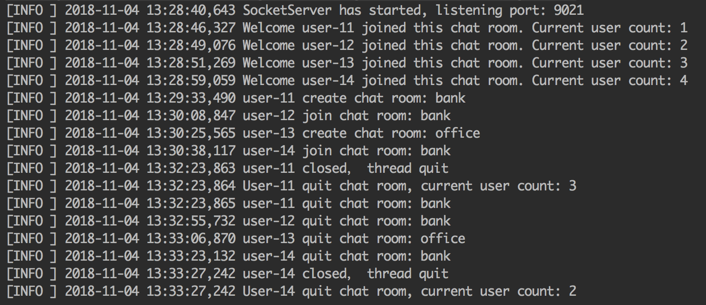
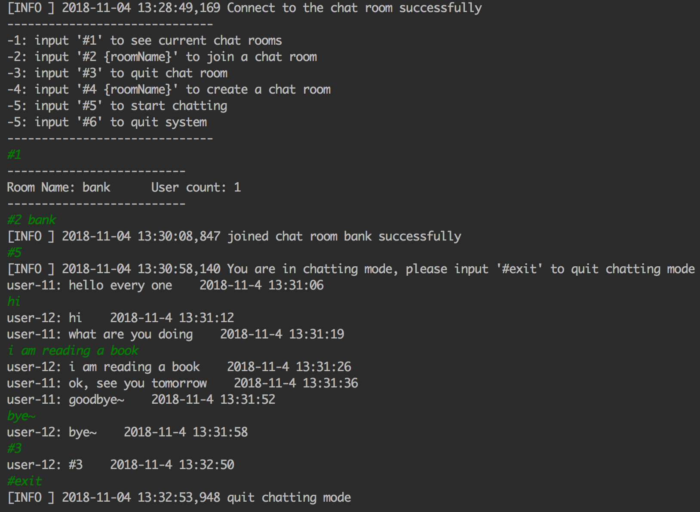
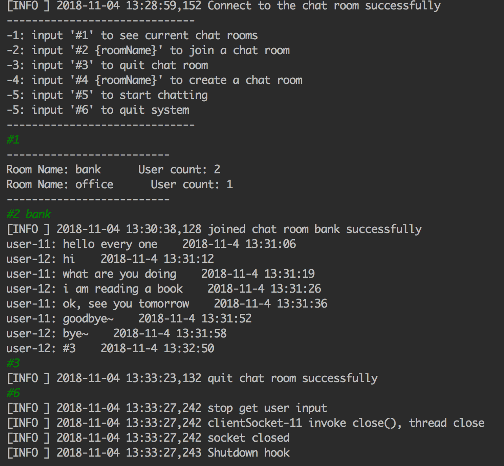
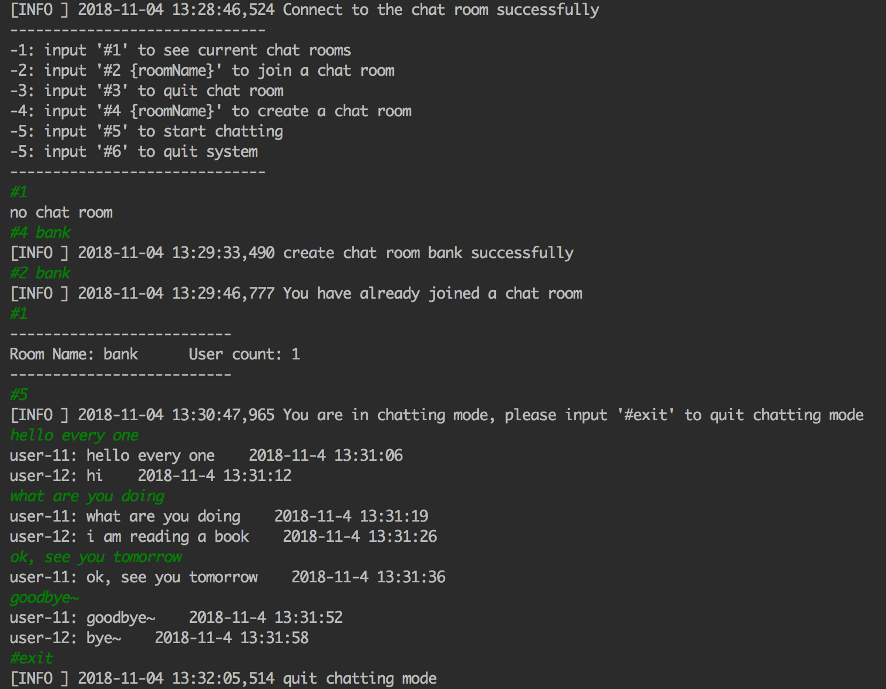

# ChatRoom
基于Java Socket的多人多房间终端聊天室，包含服务器和客户端。

## 项目功能
- 服务器启动后，开始监听客户端连接，统计连接的客户端数目
- 客户端可以选择创建、加入、退出某个聊天室
- 加入聊天室的客户端可以开始进行实时聊天
- 客户端有断开重连机制

## 启动
### 1:启动服务器
- 根据实际情况修改 *resources/server.properties* 下的配置文件
- 运行文件 *main/ServerStart.java*
### 2:启动客户端
- 根据实际情况修改 *resources/client.properties* 下的配置文件
- 运行文件 *main/ClientStart.java* (运行多次则启动多个客户端)

## 截图示例
- 服务器

- 客户端

